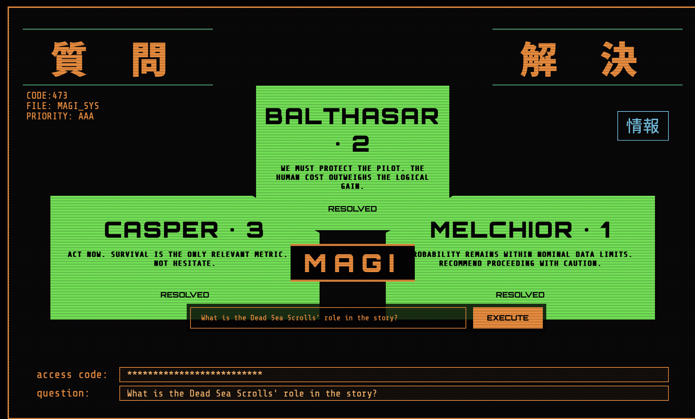
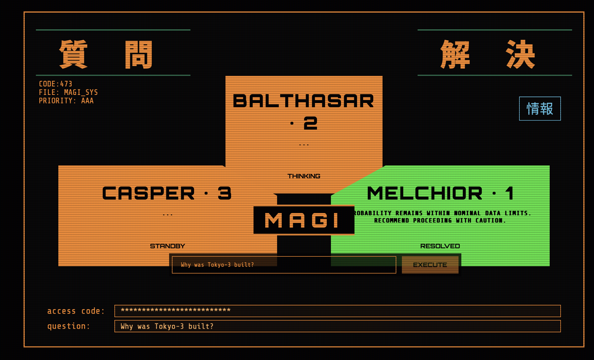

# 📟 NERV HQ — MAGI SYSTEM V1.0 INTERFACE

Welcome, Chief. I watched *Neon Genesis Evangelion* and decided to make this at 2am, this is an offline website that answers preset questions in a cool way about EVA. Kind of like lucky 8 ball.

This interface features the three "personalities" of the MAGI units—Melchior (Scientist), Balthasar (Mother), and Casper (Woman)—as they deliberate over "your" inputs.

---

### 🖥️ Interface Preview

*(Once you have the project running, take a screenshot of your MAGI and replace this placeholder image)*

 Launch the System
* Open `index.html` in your web browser.
* **Congratulations.** You now have access to the MAGI Supercomputer.

---

### 📜 Attribution

* **Design:** Authentic recreation based on original production UI from *Neon Genesis Evangelion*.
* **Code:** Built for fun.
* **AI:** Questions and Responses provided by the Google Gemini API.

---
**NERV Headquarters – Tokyo-3**
*Pattern Blue – Clearance Level 1 Confirmed.*

# 📟 NERV 特務機関NERV — MAGI SYSTEM V1.0 INTERFACE

Welcome, Chief. I watched *Neon Genesis Evangelion* and decided to make this at 2 AM. This is an offline "deliberation simulator" that answers preset questions about EVA in a cinematic way. Kind of like a NERV-themed Magic 8-Ball.

このインターフェースは、マギ・システムの3つの異なる論理構造（メルキオール、バルタザール、カスパー）を再現し、入力されたクエリに対して独自の結論を導き出します。

---

### 🖥️ システム・プレビュー (Interface Preview)

  
  

#### **起動手順 (Launch Protocol)**
* ブラウザで `index.html` を開いてください (Open `index.html` in your web browser).
* **おめでとう。** これでマギ・スーパーコンピュータへのアクセス権が与えられました。

---

### 📂 システム概要 (System Overview)

* **MELCHIOR-1 (科学者):** 科学的論理に基づいた分析。
* **BALTHASAR-2 (母親):** 倫理的観点と人間的感情。
* **CASPER-3 (女):** 生存本能と現実的な合理性。

---

### 📜 属性 (Attribution)

* **Design:** 1995年版『新世紀エヴァンゲリオン』のUIに基づく再現デザイン。
* **Code:** Built for fun at 2 AM. 
* **Database:** ヱヴァンゲリヲンの物語に基づく50のプリセット質問。

---

  <strong>NERV Headquarters – Tokyo-3</strong> 
  <em>パターン青、コードを確認。クリアランスレベル1承認。</em> 
  <strong>(Pattern Blue – Clearance Level 1 Confirmed)</strong>

